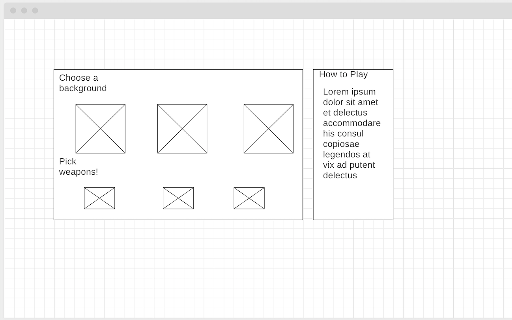

# Background

Browser Destroyer is a twist to your favorite classic game Desktop Destroyer. The user will be able to pick a background of their choosing, weapon of their choice, and start "destroying" the said background. Users can also find hidden elements that will completely destroy the background within seconds. There are no high scores/points so the game can be played for hours on end.

# Functionality & MVP

In Browser Destroyer, users will be able to:

* Start, and also have the option to end the game whenever the user chooses, since there are no high scores/points for this game.

* Pick a background("browser") of their choice.

* Choose a weapon that you wish to use to "destroy" the said background("browser").

* Find hidden element within the background("browser") which will initiate a fancy explosion animation users can enjoy.

In addition, this project will also include:

* A modal with a gif showcasing the game in action, with a brieft how to play.

* A production README.

# Wireframes

Browser Destroyer will have a screen where you can choose backgrounds("browsers) and weapons, and a separate fixed screen where you can start/end the game. When the game starts, the background("browser") will fill up the whole browser allowing you to wreak havoc until the background("browser") is completely destroyed, find the hidden element, or manually end the game.

# Architecture and Technologies

Browser Destroyer will be using the following technologies:

* JavaScript for game logic

* p5.js for the backgrounds("browsers"), weapons, effects

# Timeline

## Day 1

  Initial setup regarding the file structures, webpack and also setting up p5.js.
